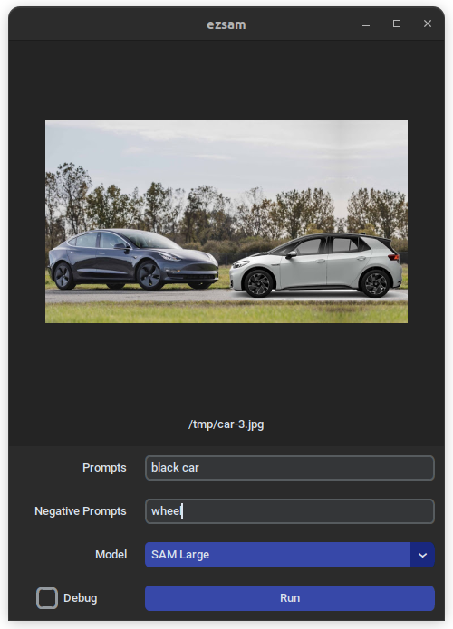

# ezsam (easy segment anything model)

A command line and gui tool to segment images and video via text prompts.

Input images and videos, describe the subjects or objects you want to keep, and output new images and videos with the background removed.

**Check out the docs! [ezsam.org](https://www.ezsam.org)**


<video src="https://github.com/ae9is/ezsam/assets/125031666/42d95ab0-2090-4dc6-a892-726699a2656f" height=200 controls>
  A large table with plates of Thanksgiving food including a whole turkey on a conveyor-style lazy susan.
</video>
<video src="https://github.com/ae9is/ezsam/assets/125031666/42d95ab0-2090-4dc6-a892-726699a2656f" height=200 controls>
  A whole cooked turkey flying through the void.
</video>


## Why?

Meta's [Segment Anything](https://github.com/facebookresearch/segment-anything) is a powerful tool for separating parts of images,
but requires coordinate prompts&mdash;either bounding boxes or points.
And manual prompt generation is tedious for large collections of still images or video.

In contrast, text-based prompts describing the object(s) in the foreground to segment can be constant.
Inspired by [Grounded-Segment-Anything](https://github.com/IDEA-Research/Grounded-Segment-Anything),
this project tries to package a simpler to use tool.

If you're not interested in text-based prompts with Segment Anything, 
check out [rembg](https://github.com/danielgatis/rembg).

## How does it work?

The foreground is selected using text prompts to [GroundingDINO](https://github.com/IDEA-Research/GroundingDINO) to detect objects.
Image segments are generated using [Segment Anything](https://github.com/facebookresearch/segment-anything) 
or [Segment Anything HQ (SAM-HQ)](https://github.com/SysCV/SAM-HQ).

## Quick start

```bash
# Ubuntu 22.04, Python 3.9 - 3.11
pip install ezsam
sudo apt install ffmpeg imagemagick
ezsam --help
ezsam-gui
```

For more detailed info, see the documentation site here: [ezsam.org](https://www.ezsam.org)
